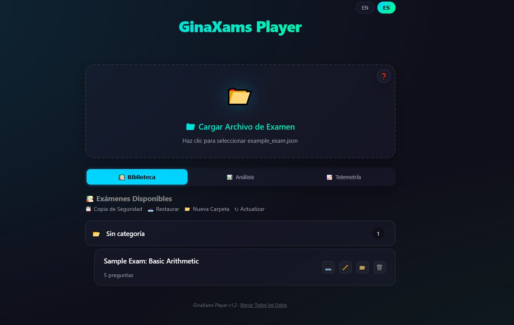
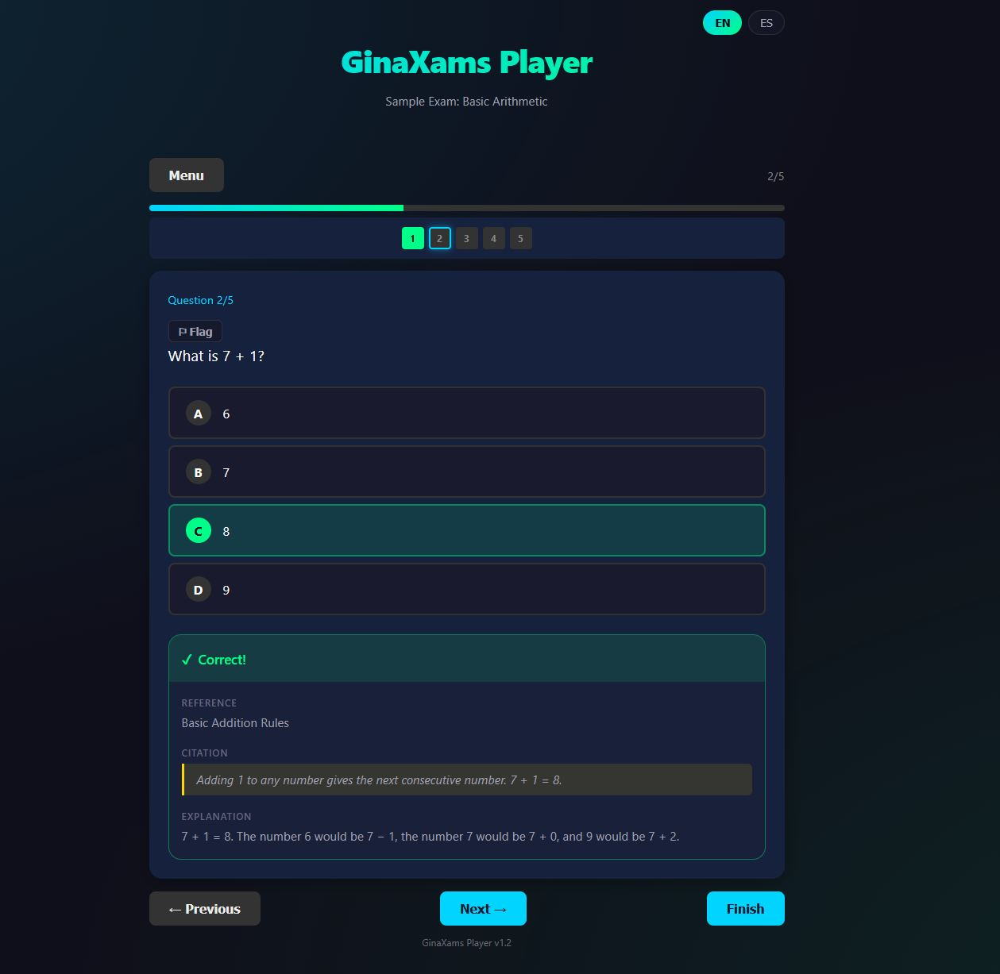
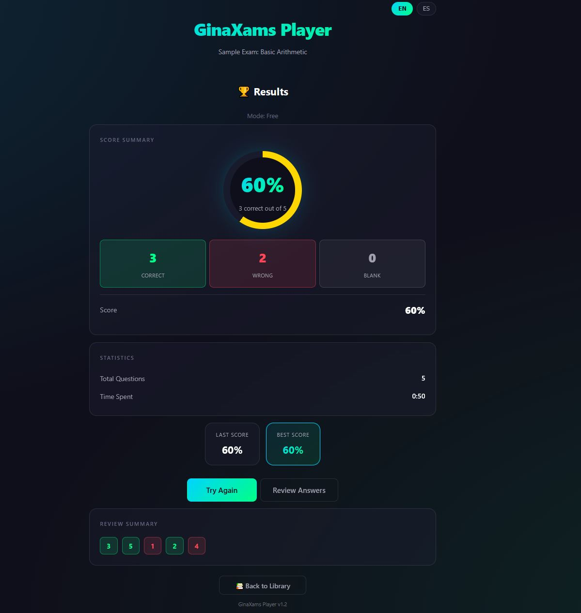
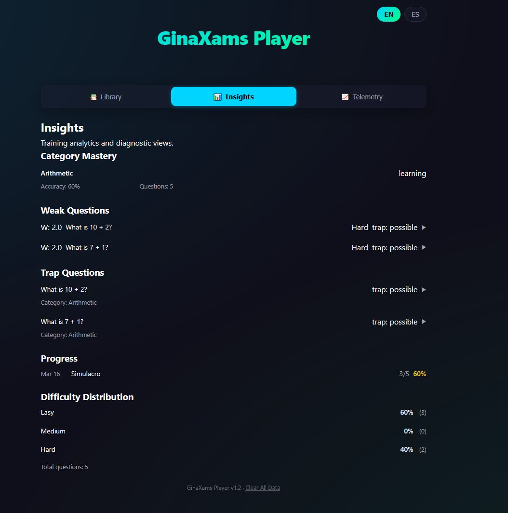
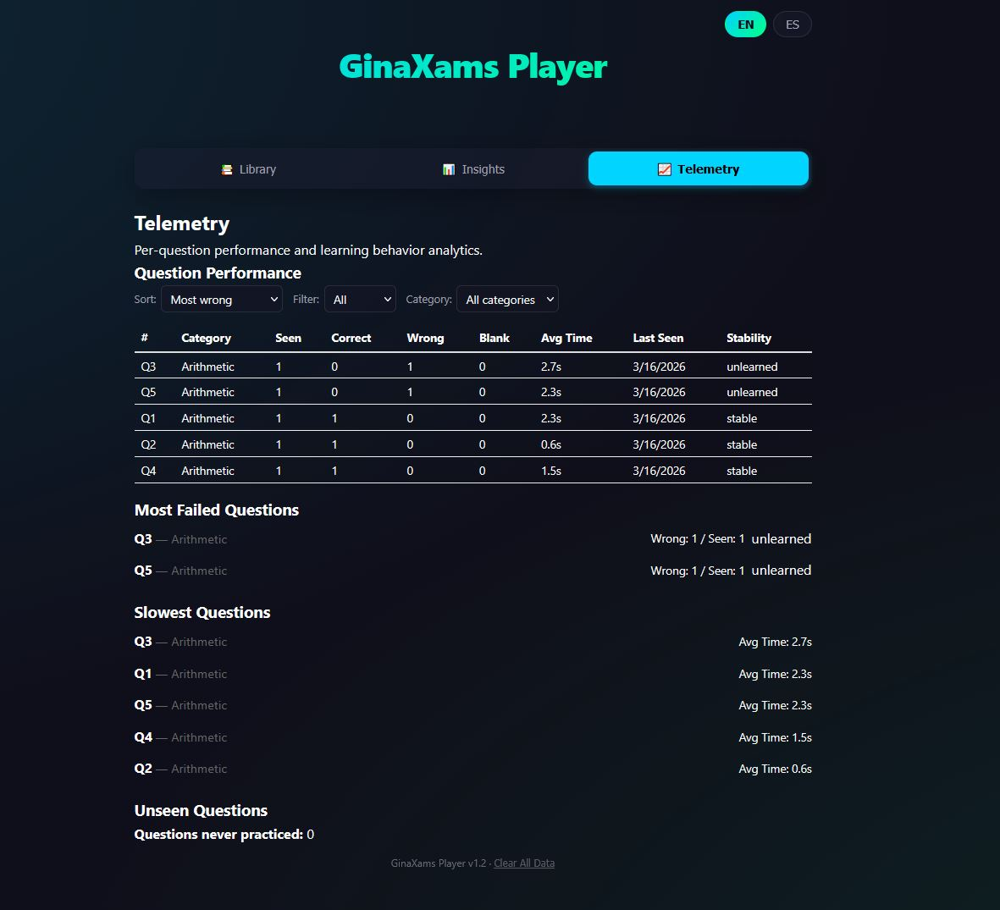

# GinaXams Player

GinaXams Player is a fully local, adaptive exam training engine built for structured preparation of official exams.

It runs entirely in the browser, requires no backend, and stores all data locally using IndexedDB. Your data never leaves your device.

🌐 **Live Demo:** https://xiscob.github.io/ginaxams-player
📦 **Repository:** https://github.com/XiscoB/ginaxams-player

---

## Features

- **Three training modes**: Free practice (instant feedback), Simulacro (timed exam simulation), and Adaptive Review (weakness-based)
- **Adaptive engine**: Prioritizes weak questions using telemetry-driven weakness scoring, spaced repetition, category mastery, and trap detection
- **Exam library**: Import, organize into folders, and manage multiple exam files (JSON schema v2.0)
- **Rich analytics**: Home dashboard with quick stats and recommendations, telemetry explorer, and insights (category mastery, difficulty distribution, trap questions, weak questions, progress tracking)
- **Exam readiness score**: 0–100 composite score based on mastery, recent simulacro results, and recovery rate
- **Bilingual**: Full English and Spanish support with auto-detection
- **Keyboard shortcuts**: Navigate questions and submit answers without touching the mouse
- **Data portability**: Full backup/restore of all data (exams, telemetry, attempts, folders)
- **Privacy-first**: Fully client-side, no backend, no tracking — GitHub Pages deployable
- **881 unit tests**: Comprehensive coverage across domain, application, UI, and i18n layers

---

## Screenshots

### Home



### Practice with Feedback



### Exam Results



### Insights Dashboard



### Telemetry Explorer



---

## Getting Started

### Prerequisites

- Node.js 18+
- npm

### Install & Run

```bash
npm install
npm run dev       # Start development server
```

### Build for Production

```bash
npm run build     # TypeScript check + Vite build
npm run preview   # Preview the production build locally
```

The output in `dist/` is a static site deployable to GitHub Pages or any static host.

### Running Tests

```bash
npm test              # Unit tests in watch mode (Vitest)
npm test -- --run     # Unit tests single run
npm run test:e2e      # End-to-end tests (Playwright)
```

---

## Training Modes

### Free Practice

Learn at your own pace with instant feedback after each answer. Feedback includes the correct answer, the legal article reference, the literal citation, and an explanation. **Does not update telemetry** — safe for exploration.

### Simulacro (Exam Simulation)

Simulates real exam conditions:

- Weighted multi-exam selection with seeded RNG (deterministic sampling)
- Configurable question count, time limit, reward, and penalty
- Auto-submits when the timer expires
- **Updates telemetry** on completion

**Scoring**: `score = (correct × reward) - (wrong × penalty) - (blank × blankPenalty)`

### Review (Adaptive Engine)

Targets your weakest areas using accumulated telemetry:

1. Computes a weakness score per question
2. Applies adaptive mix: 60% weakest, 30% medium, 10% random
3. Integrates spaced repetition cooldowns and category mastery boosts
4. Fills remaining slots with least-recently-seen questions
5. **Updates telemetry** on completion — review sessions feed themselves

**Weakness formula**:

```
weakness = (timesWrong × wrongWeight)
         + (timesBlank × blankWeight)
         + timePenalty
         - (consecutiveCorrect × recoveryWeight)
```

Result is clamped to >= 0. All weights are configurable (see Defaults below).

---

## Telemetry

Per-question telemetry is tracked across simulacro and review attempts. Historical mistake counts are **never deleted** — the weakness score is derived at runtime.

| Field                | Type     | Description                        |
| -------------------- | -------- | ---------------------------------- |
| `timesCorrect`       | `number` | Correct answer count               |
| `timesWrong`         | `number` | Wrong answer count                 |
| `timesBlank`         | `number` | Blank answer count                 |
| `consecutiveCorrect` | `number` | Current correct streak             |
| `avgResponseTimeMs`  | `number` | Rolling average response time      |
| `totalSeen`          | `number` | Total presentations                |
| `lastSeenAt`         | `string` | ISO timestamp of last presentation |

Telemetry can be reset per exam or globally. Deleting an exam cascades: removes its telemetry and related attempts.

---

## Analytics & Insights

The app provides several analytical views powered by telemetry data:

- **Home Dashboard**: Quick stats (exams loaded, questions practiced, accuracy) and personalized recommendations
- **Telemetry Explorer**: Per-question performance breakdown
- **Category Mastery**: Weak / Learning / Mastered classification per category
- **Difficulty Distribution**: Easy / Medium / Hard question classification based on error rates
- **Trap Detection**: Identifies trick questions with high error rates
- **Weak Questions**: Sorted list of questions needing the most practice
- **Progress Tracking**: Improvement over time
- **Exam Readiness**: Composite 0–100 score estimating preparedness

---

## Exam Data Format (Schema v2.0)

All imported exams must comply with `schema_version: "2.0"`. Strict validation is enforced — invalid files throw descriptive errors.

```json
{
  "schema_version": "2.0",
  "exam_id": "unique-exam-id",
  "title": "Official Exam Title",
  "categorias": ["Constitucion", "TREBEP"],
  "total_questions": 2,
  "questions": [
    {
      "number": 1,
      "text": "Question text goes here?",
      "categoria": ["Constitucion"],
      "articulo_referencia": "Art. 103 CE",
      "feedback": {
        "cita_literal": "Literal text from the official source...",
        "explicacion_fallo": "Explanation of why wrong answers are incorrect..."
      },
      "answers": [
        { "letter": "A", "text": "Option A text", "isCorrect": false },
        { "letter": "B", "text": "Option B text", "isCorrect": true },
        { "letter": "C", "text": "Option C text", "isCorrect": false },
        { "letter": "D", "text": "Option D text", "isCorrect": false }
      ]
    }
  ]
}
```

A sample exam is included at [practice/examples/example_exam.json](practice/examples/example_exam.json).

### Required Fields

**Exam level**: `schema_version` (literal `"2.0"`), `exam_id`, `title`, `categorias` (non-empty array), `total_questions` (must equal `questions.length`), `questions`.

**Question level**: `number`, `text`, `categoria` (subset of exam's `categorias`), `articulo_referencia`, `feedback.cita_literal`, `feedback.explicacion_fallo`, `answers` (exactly one `isCorrect: true`).

---

## Configurable Defaults

All engine parameters are centralized in `src/domain/defaults.ts` and injected into domain functions — no magic numbers.

| Parameter                  | Default | Description                           |
| -------------------------- | ------- | ------------------------------------- |
| `reviewQuestionCount`      | 60      | Questions per review session          |
| `wrongWeight`              | 2.0     | Weakness weight for wrong answers     |
| `blankWeight`              | 1.2     | Weakness weight for blank answers     |
| `recoveryWeight`           | 1.0     | Recovery for consecutive correct      |
| `weakTimeThresholdMs`      | 15000   | Slow-answer penalty threshold (15s)   |
| `reviewWeakRatio`          | 0.6     | Adaptive mix: weak question share     |
| `reviewMediumRatio`        | 0.3     | Adaptive mix: medium question share   |
| `reviewRandomRatio`        | 0.1     | Adaptive mix: random question share   |
| `reviewCooldownWindowMs`   | 300000  | Spaced repetition cooldown (5 min)    |
| `trapPossibleThreshold`    | 0.4     | Trap detection: possible threshold    |
| `trapConfirmedThreshold`   | 0.7     | Trap detection: confirmed threshold   |
| `readinessSimulacroWindow` | 5       | Recent simulacros for readiness score |

---

## IndexedDB Schema (v4)

| Store               | Purpose                | Key Path                                      |
| ------------------- | ---------------------- | --------------------------------------------- |
| `exams`             | StoredExam objects     | `id`                                          |
| `folders`           | Folder objects         | `id`                                          |
| `attempts`          | Attempt records        | `id`                                          |
| `questionTelemetry` | Per-question telemetry | `id` (format: `${examId}::${questionNumber}`) |

---

## Tech Stack

- **TypeScript (strict mode)**
- **Vite**
- **IndexedDB**
- **Vitest — 881 tests**
- **Playwright (E2E)**

**Runtime:** zero dependencies, no frameworks, pure DOM APIs.

---

## Non-Goals

- No backend integration
- No framework migration (React, Vue, etc.)
- No legacy schema compatibility
- No telemetry mutation shortcuts

---

## License

MIT

## Architecture Overview

GinaXams Player uses a layered architecture where each layer has a clear responsibility and boundary.

### Layered Architecture

- src/domain: Pure business rules and deterministic logic, including scoring, weakness computation, review selection, telemetry transitions, and schema validation.
- src/application: Use-case orchestration and runtime flow control, including attempt coordination, timers, settings coordination, and integration between domain and persistence.
- src/storage: IndexedDB access, schema versioning, migrations, and cascade operations for persisted exams, attempts, and telemetry.
- src/ui: Presentation components, view composition, and user interaction handling. This layer renders state and dispatches user intent to application services.
- src/core: App bootstrap and composition root. It wires controllers, services, and UI mounting so the full system starts with explicit dependencies.

### Deterministic Domain Design

- Domain logic must be deterministic: the same inputs must always produce the same outputs.
- Domain functions do not call Math.random or Date.now.
- Any randomness or clock behavior is injected from outside the domain, typically by application orchestration using seeded RNG and explicit timestamps.

### Adaptive Review Pipeline

Conceptual flow:

1. Telemetry collection from persisted per-question history.
2. Weakness calculation using configured weights and response-time penalty rules.
3. Question ranking by descending weakness.
4. Question selection for the target review size, with fallback fill behavior when needed.
5. Attempt execution that records outcomes and updates telemetry for supported attempt types.

### Telemetry Model

Tracked metrics per question:

- timesCorrect
- timesWrong
- timesBlank
- consecutiveCorrect
- avgResponseTimeMs
- totalSeen
- lastSeenAt

Weakness is not stored as a persistent field. It is derived at runtime from telemetry plus configuration.

### Testing Strategy

- Domain logic is fully unit tested.
- Core domain functions are deterministic pure functions, making results reproducible.
- The project uses a Vitest test suite for automated verification.
- UI behavior is primarily validated through manual testing during reconstruction.
